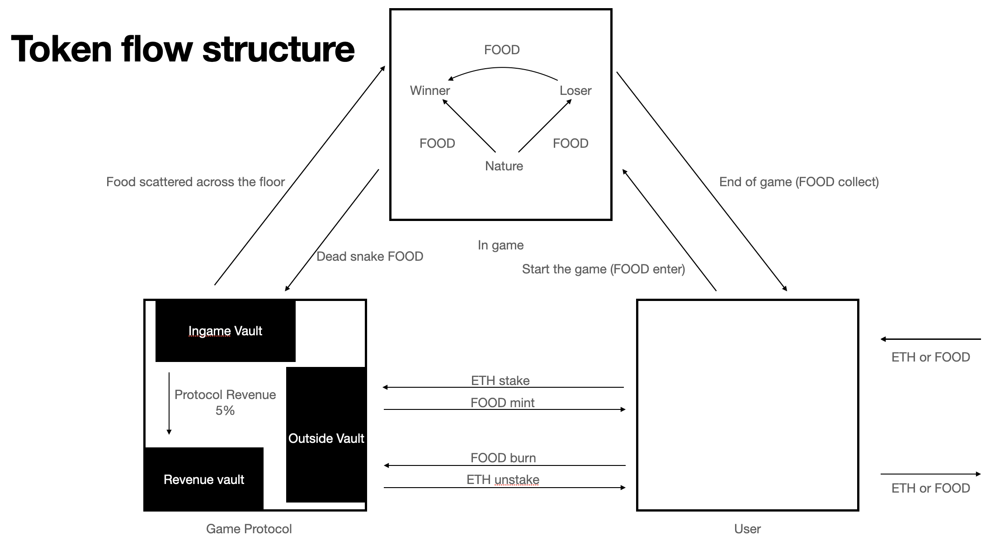

# Global_Warming

Demo for blast bigbang competition 

This Demo of P2E game on Blast sepolia testnet.

# Original slither.io game rules
As the worm consumes food from the ground, it grows in length and size

When the food bumps into another worm, it is converted into FOOD

# Game rules added in Web3.ver
Tokenize existing food (food = worm body = token).

You grow your worms by killing your opponent's worms or collecting food from the floor.

If you end the game with a worm alive, you get a token equal to the food you collected.

These tokens can be freely withdrawn

# Detailed rules
10 tokens per inch of worm body.

Players can start the game with a minimum of 10 and a maximum of 100 worms

Killed worms yield 0.8x the food of live worms

Of the remaining 20% of food, 75% becomes food that is scattered 

uniformly on the floor, and the remaining 25% becomes the protocol's revenue.

# How to run
1. Clone this project

'''
git clone https://github.com/peter4885/Global_Warming.git
'''

2. Install dependencies

'''
npm init
npm install phaser
npm install web3
'''

3. Install http-server globally

'''
npm install -g http-server
'''

4. Run the server

'''
http-server
'''
